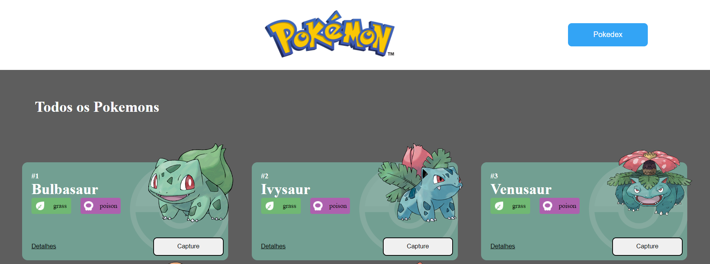
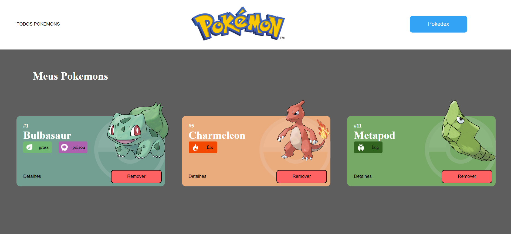
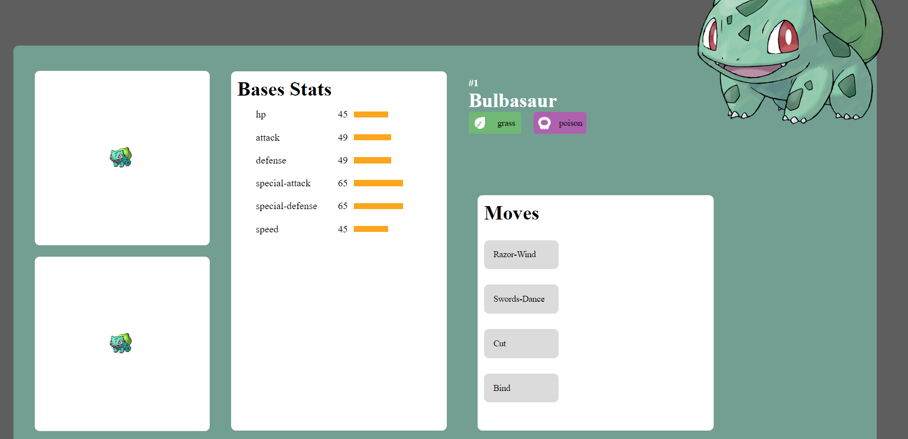

# Projeto React API Pokemons


Uma pagina que mostra dados de alguns Pokemons

## Indice
- <a href="#Tecnológias-utilizadas"> Tecnológias utilizadas</a>
- <a href="#layout ">Layout </a>
- <a href="#demostração ">Demostração </a>
- <a href="#comorodaresseprojeto ">Como rodar esse projeto?</a>
- <a href="#tecnologiasutilizadas ">Tecnologias utilizadas</a>
- <a href="#pessoasautoras">Pessoas autoras</a>
- <a href="#proximospassos ">Proximos passos</a>

## 📱Fucionalidades do projeto

- O site tem 3 páginas: Home, Pokedex e Detalhes;
-  Projeto está seguindo esse <a href="https://www.figma.com/file/KseyA2Ofghiek2Cy3ZaDre/Poked%C3%A9x" >desing</a> design;
- **Página Home:**
	- [X]  Mostra uma lista de Pokemons;
	- [X] Cada Pokemon e representado por um Card;
	- [X] Em cada card de Pokemon tem um botão para adicioná-lo à Pokedex e um outro botão para acessar os detalhes do Pokemon;
	- [X] Header dessa página terá um botão para acessar a página da Pokedex;
- **Página Pokédex**
	- [X] Renderiza uma lista de pokémons que foram adicionados na pokedex;
	- [X] Em cada card de Pokemon tem um botão para removê-lo da Pokedex e um outro botão para acessar os detalhes do Pokemon.
	- [X] Header deve tem um botão para voltar para a Home
	- [X] Não deve ser possível adicionar o mesmo Pokemon duas vezes na Pokedex
    - **Página de Detalhes**
	- [X] Mostra os detalhes do Pokemon selecionado, com informações descritas
	- [X] Header deve ter um botão para adicionar ou remover da Pokedex e outro para voltar a página home.

    ## 👀Layout







## Demonstração

[Link demonstração](https://projetolabenuapismatheusbarbosaa.surge.sh/)

## Como rodar esse projeto?

```bash
# clone este repositorio
$ git clone link

# Acesse a pasta do projeto no seu terminal
$  cd PokeAPI/

#instale as depedências
$ npm install

# Execute a aplicação
$ npm run start
# A aplicação sera iniciada na porta 300, 
acesse pelo navegador: http:http://localhost:3000
```
