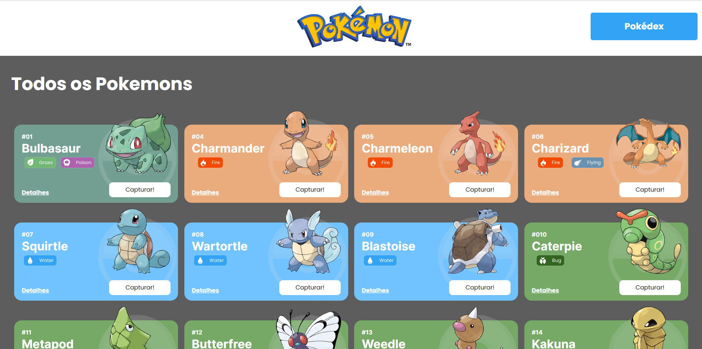
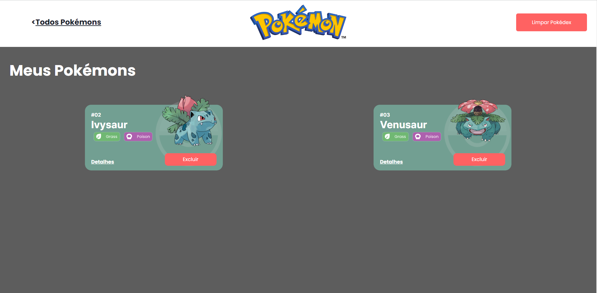
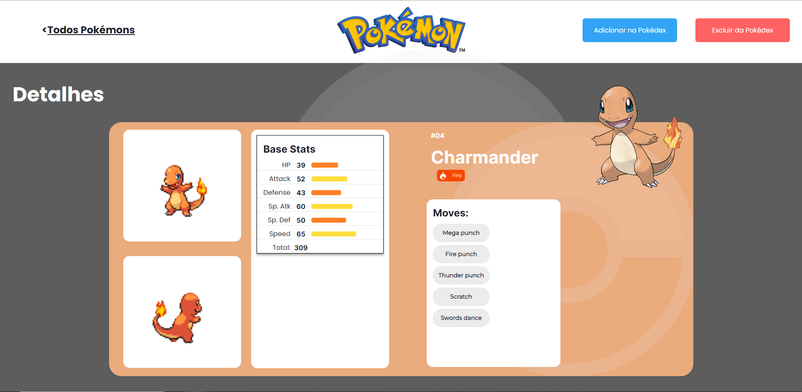

# Projeto Pokémons


Uma pokedéx contendo 20 Pokémons 

## Índice
- <a href="#funcionalidades">Funcionalidades do Projeto</a>
- <a href="#layout">Layout</a>
- <a href="#Demonstração">Demonstração</a>


## Funcionalidades
- [x] Capturar Pokémons para a pokedéx
- [x] Excluir pokémons da pokedéx
- [x] Limpar a pokedéx
- [x] Ver os detalhes dos Pokémons

## Layout




## Demonstração

## Para rodar o projeto

``` bash
# Clone o repositório
$ git clone Linkdorepo

# Acesse a pasta do projeto 
$ cd projeto-react-apis

# Instale as dependências
$ npm install ou npm i
$ npm i @chakra-ui/react @emotion/react @emotion/styled framer-motion
$ npm install axios
$ npm install react-router-dom

# Execute a aplicação 
$ npm run start
```

## Tecnologias Utilizadas
1. [React](https://pt-br.reactjs.org/)
2. [React Router](https://reactrouter.com)
3. [Chakra Ui](https://chakra-ui.com/)
4. [Axios](https://axios-http.com)

## Pessoas Autoras

[Linkedin](https://www.linkedin.com/in/luiz-kessler-557b3a24a/)

