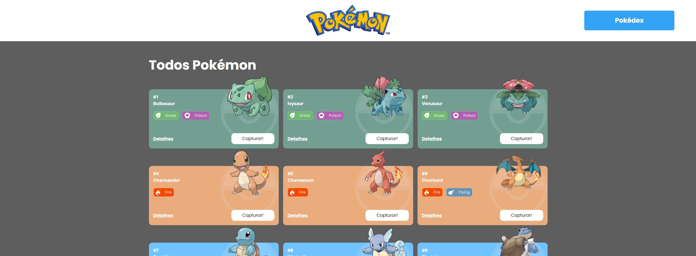
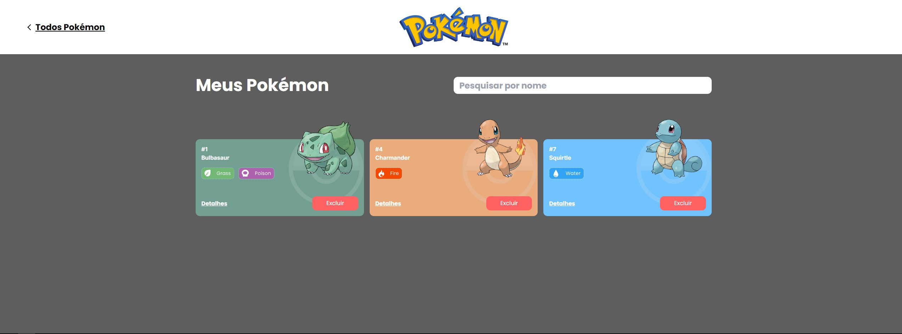
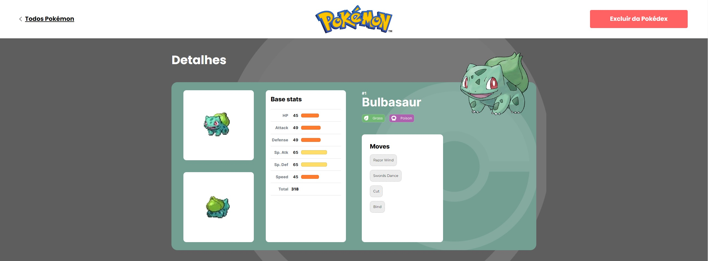

# Pokédex

Este projeto é uma pokedex online que permite aos usuários ver informações sobre pokemons. também permite que os usuários capturem e adicionem pokemons à sua própria pokedex.

## Índice

- <a href="#funcionalidades">Funcionalidades</a>
- <a href="#tecnologias-utilizadas">Tecnologias utilizadas</a>
- <a href="#layout-web">Layout web</a>
- <a href="#como-rodar-o-projeto">Como rodar o projeto</a>
- <a href="#créditos">Créditos</a>

## <a name="#funcionalidades"></a>Funcionalidades

- Mostra uma lista de pokemons, contendo imagem, tipos, nome e id
- Mostra informações mais detalhadas de cada pokemon em uma página a parte
- Adicionar/remover pokemons da sua pokedex pessoal

## Tecnologias utilizadas

- [ReactJS](https://react.dev/): biblioteca JavaScript para construir interfaces de usuário
- [Next.JS](https://nextjs.org/): framework React para construir aplicativos renderizados do lado do servidor
- [Tailwind CSS](https://tailwindcss.com/): utility-first CSS framework
- [Axios](https://axios-http.com/docs/intro): cliente HTTP baseado em promises para fazer requisições de APIs
- [PokéAPI](https://pokeapi.co/): API pública para obter informações sobre Pokémon

## Layout web

**Página principal**
</img>
**Pokedex**
</img>
**Detalhes do pokemon**
</img>

# Como rodar o projeto?

```
# Clone este repositório
$ git clone https://github.com/brenomorp/pokedex.git

# Acesse a pasta do repositório
$ cd pokedex

# Instale as dependências
$ npm install

# Execute a aplicação
$ npm run dev
```

# Créditos

Este projeto foi desenvolvido por [Breno Moreira](https://www.linkedin.com/in/brenomorp/) no Bootcamp da [Labenu](https://www.labenu.com.br/)

Contribuições são sempre bem-vindas! Se você encontrar algum problema ou tiver alguma sugestão de melhoria, sinta-se à vontade para abrir uma issue ou fazer um pull request.
