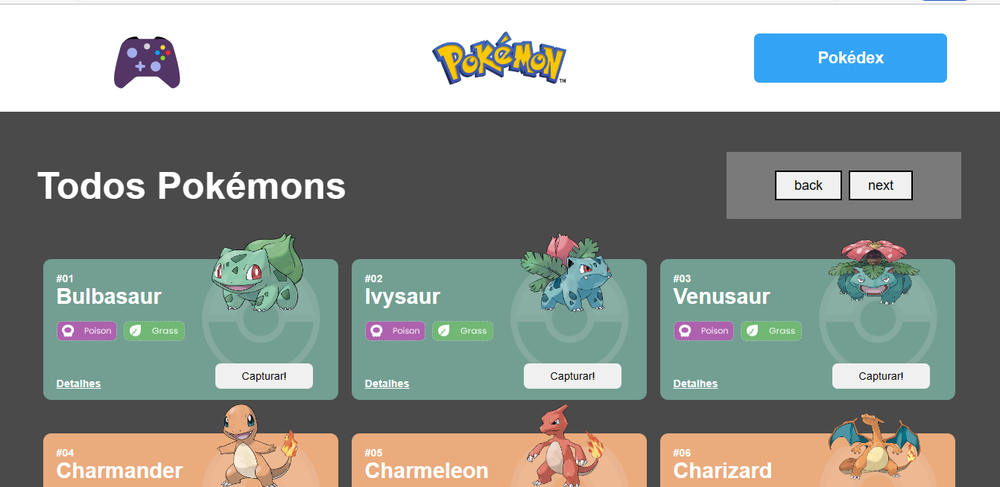

# Projeto React e API's Pokedex

Pokédex / API

## Stack utilizada :
* React-router-dom  
* Styled-components 
* React-modal 
* Requisições Fetch ( async e await )

## Funcionalidades

1- Home 

Lista 21 pokémons com seus respectivos nomes e tipos. Possui botões de capturar e para ver os detalhes. Clicando em Next traz mais resultados de Pokémons.

2- Pokédex 

Mostra quantidade de pokémons capturados, podendo remover um ou todos os pokémons de uma vez.

3- Detalhes  

Possui botões de capturar ou remover da pokédex, mostra alguns detalhes sobre o pokémon como os movimentos, e detalhes sobre a sua força.

4- Jogo  

A página de jogo consiste em um jogo da velha, inicialmente os valores são O e X. Existe a opção de trocar de personagem do jogo de acordo com a quantidade de pokémons na pokédex, quanto mais pokémons capturar mais personagem terá. O jogo consiste em jogadores 1 e 2.

## Sobre mim 
Olá, me chamo Mauricio! sou apaixonado por Programação e Pentest 😍

## Links
linkedin : https://www.linkedin.com/in/maur%C3%ADcio-leite-silva-aa375b16a/  
github : https://github.com/maumau1998
