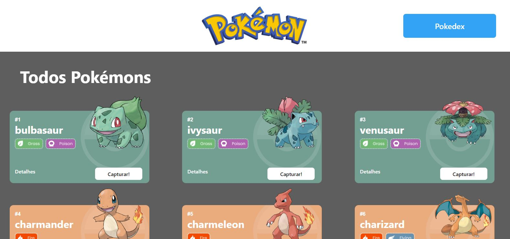
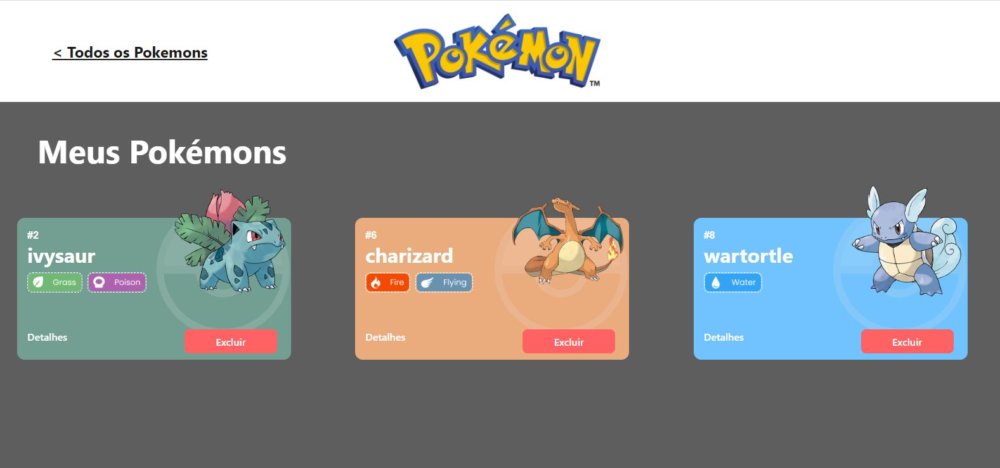
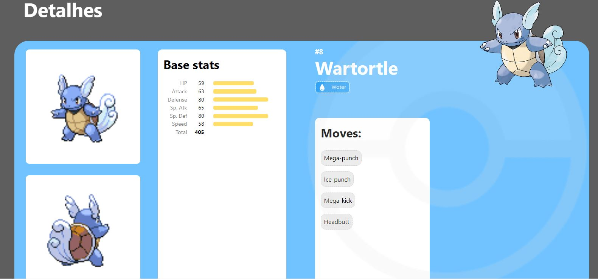

# **Projeto React e API's / Pokedéx com PokeApi**


Uma lista de Pokémons que podem ser adicionados e excluídos da Pokedéx, sendo possível também consultar mais informações sobre os Pokémons.

## Demonstração:
[Link demonstração](http://poke-api-alex.surge.sh/)

## 🔧 Funcionalidades do Projeto
- [x] Listagem de Pokémons
- [x] Adicionar Pokémon na Pokédex
- [x] Excluir Pokémon na Pokédex
- [x] Consultar Informações detalhadas dos Pokémons
- [x] Responsivo para smartphones

## 📺 Layout




## Como rodar este projeto?
```bash
# Clone este repositório
$ git clone linkrepo

# Acesse a pasta do projeto no seu terminal
cd projeto-react-apis

# Instale as dependências
$ npm install

# Execute a aplicação
$ npm run dev
```

## Tecnologias utilizadas
1. [React](https://react.dev/)
2. [Vite](https://vitejs.dev/)
3. [React Router](https://reactrouter.com/en/main)
4. [Styled-Components](https://styled-components.com/)
5. [Axios](https://axios-http.com/docs/intro)

## Autor
 - Alex Fernandes da Silva

[Linkedin](https://www.linkedin.com/in/alex-fernandes-silva/)


## 👟 Próximos passos
- [ ] Listar os 150 primeiros Pokémons
- [ ] Adicionar botão para passar página de listagem de Pokémons
- [ ] Buscador de Pokémon por nome
- [ ] Filtro de Pokémos por tipo
 
