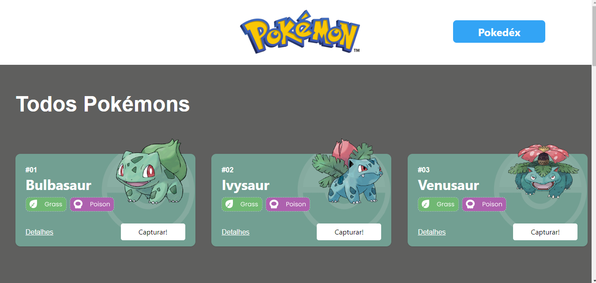
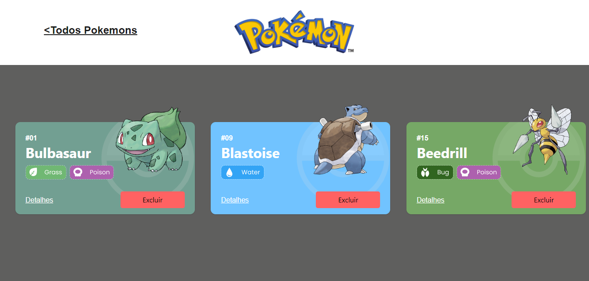
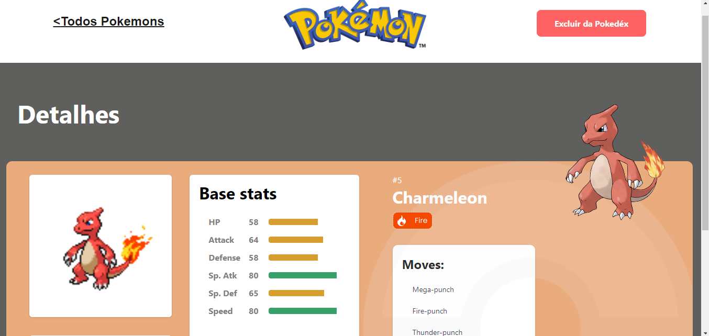

# Projeto Pokedéx(React Api's)

Este projeto tem como fonte de dados para a sua criação a Poke Api, uma Api pública, muito usada para aplicações focadas em aprendizado de programação e também usada em cases de processos seletivos.

## Estrutura do projeto:

+Página Home: 

- Mostra a lista de Pokemons;
- Cada Pokemon é representado por um Card;
- Em cada card de Pokemon tem um botão para adicioná-lo à Pokedex e um outro botão para acessar os detalhes do Pokemon;
- O cabeçalho dessa página tem um botão para acessar a página da Pokedex

+Página Pokédex

- Renderiza a lista de pokémons adicionados na pokedex;
- Em cada card de Pokemon deve tem um botão para removê-lo da Pokedex e um outro botão para acessar os detalhes do Pokemon.
- O cabeçalho tem um botão para voltar para a Home
- Não é possível adicionar o mesmo pokemon na Pokedéx mais de um vez(é exibido um alert)
- Os dados de sua Pokedéx são guardados através do uso do LocalStorage.

+Página de Detalhes

- Mostra os detalhes do Pokemon selecionado, com informações descritas
- O cabeçlho tem um botão para adicionar ou remover da Pokedex e outro para voltar a página home.

Tecnologias Utilizadas:

    React
    React Router
    Styled-components
    Chakra UI
    React Context
    Axios
    LocalStorage

- Link do deploy do projeto: https://projeto-react-apis-pho1.vercel.app/

