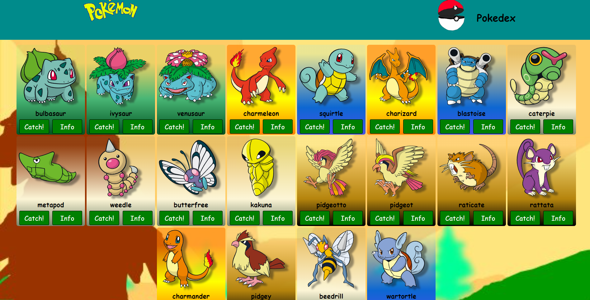
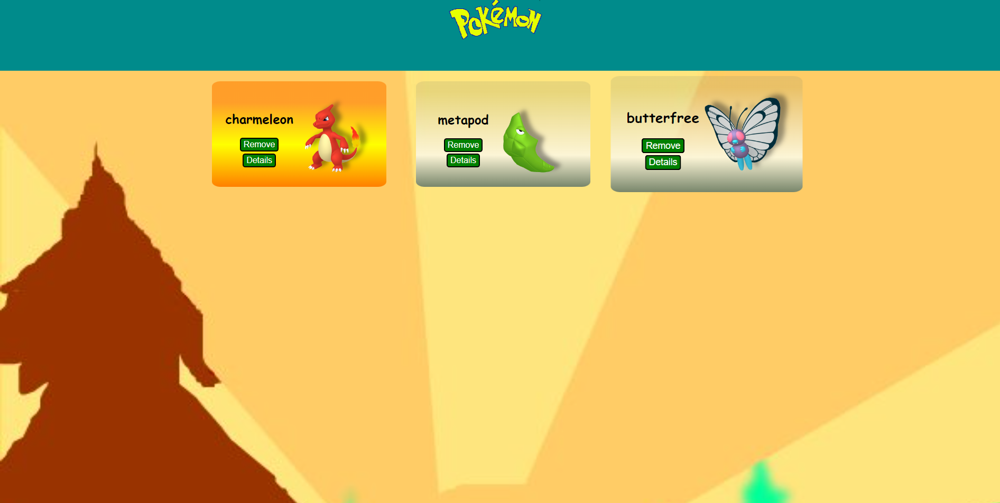
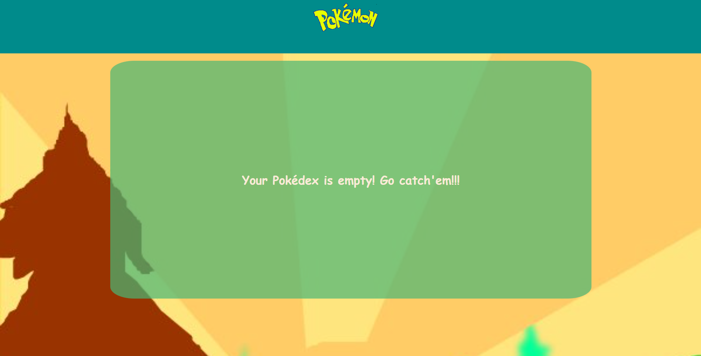
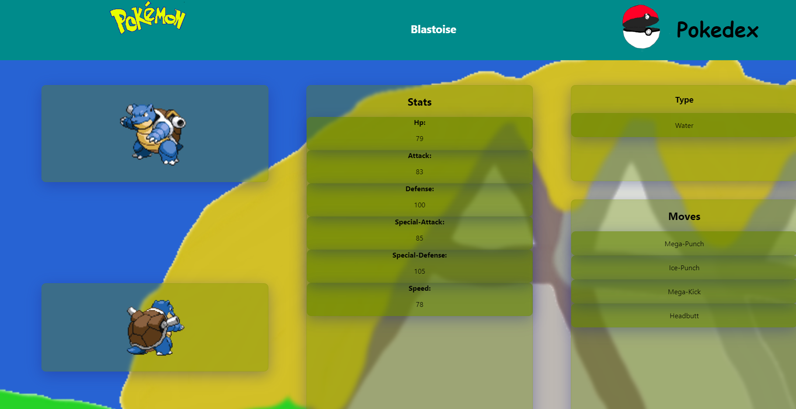

# Projeto Pokedex

Projeto de site em React com cartas de Pokemon. As imagens e o design utilizados, foram escolhidos de propósito.
## Índice
- <a href="funcionalidades"> Funcionalidades do projeto </a>
- <a href="layout"> Layout </a>
- <a href="demonstracao"> Demonstração </a>
- <a href="rodar"> Como rodar o projeto </a>
- <a href="tecnologias-utilizadas">Tecnologias Utilizadas</a>
## Funcionalidades do Projeto
- [x] 3 páginas: Home, Pokedex e Detalhes

Home
- [x] Mostra uma lista com 20 Pokemons
- [x] Cada Pokemon representado por uma carta
- [x] Botão para acessar pokedex
- [x] Botão de detalhes

Pokedex
- [x] Botão de retorno à Home
- [x] Botão de detalhes
- [x] Remover pokemon

Detalhes
- [x] Mostra informações
- [x] Voltar para pokedex
- [x] Voltar para a Home
## Layout
 Página Inicial

 Pokedex

 Pokedex vazia

 Informação

## Demonstração
[Clique aqui para ver](https://lugalzaggisi-aboriginal-wren.surge.sh/)

## Como Rodar o Projeto
``` bash
# Clone este Repositório
$ git clone linkrepo

# Acesse a pasta do Projeto
$ cd projeto-react-apis/pokedex

# Instale as dependências
$ npm install

# Execute a aplicação
$ npm run start

# A aplicação será iniciada pela porta 3000 e abrirá no seu navegador padrão pelo endereço: http://localhost:3000
```
## Tecnologias Utilizadas
1. [React](https://pt-br.reactjs.org/)
2. [React Router](https://reactrouter.com/en/main)
3. [Styled Components](https://styled-components.com/)