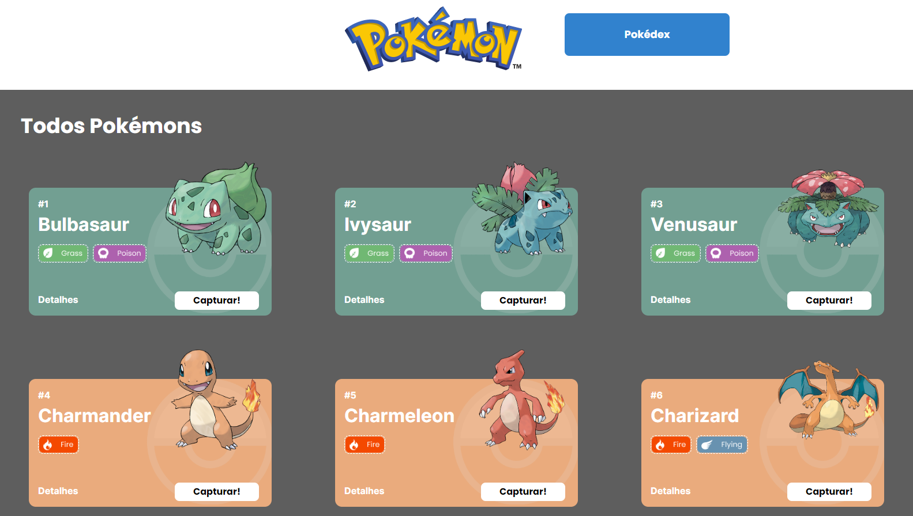
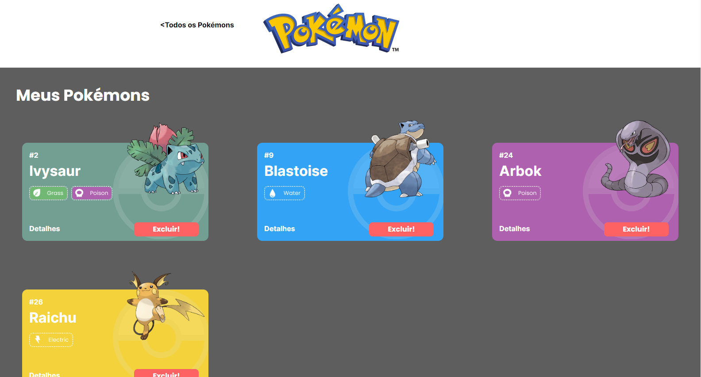

# Pokédex - Projeto React e API's 


## 📖 Introdução
Essa Pokédex é uma aplicação web que possui 3 páginas (Home, Pokédex e Detalhes), onde é possível acessar uma lista de pokémons, adiciona e/ou remove-lo de uma pokédex e também acessar uma pagina de detalhes de cada pokémon. Todos os dados exibidos na aplicação foram obtidos utilizando a API [PokeApi](https://pokeapi.co/).


## 🔗 Link da aplicação

- Deploy Vercel: [aqui.](https://projeto-pokedex-two.vercel.app/)

## 👨‍💻 Desenvolvido Por:
| [<br><sub>Henrique Batista</sub>](https://github.com/HenriqBatista)|
|:---:|

<br>
<br>
<br>

## 📝 Passos para rodar o Projeto em sua máquina:

```bash
# Instalando dependências
npm install

# executando o projeto
npm run start
```

<br>
<br>

## 💻 Preview Desktop
 <br><sub>Home Page</sub><hr><br><sub>Pokédex Page</sub><hr><br><sub>Details Page</sub> <hr><br>


## 🤓 Funcionalidades
```bash
### Home Page
. Listagem de uma lista de pokemons com alguns detalhes de cada pokémon e a funcionalidade de adicionar o pokémon a sua pokédex e ir para a tela de detalhes.

### Pokédex Page
. Após o pokémon ser capturado na Home Page, ele virá para essa página, onde irá permanecer a opção de ir para a página de detalhes deste pokémon e uma outra opção de excluir o pokémon da sua pokédex.

### Details Page
. Nessa Página terá todas as informações adicionais de cada pokémon como: Base Stats e Moves.
````
<br></br>

## 📚 Bibliotecas Utilizadas

````bash
styled-components
react-router-dom
axios
chakra ui
````
<br></br>

## 💡Programas utilizados:
- VSCode

<br></br>

## 💻Tecnologias 


<br></br>
# 📫 Contatos

📧 E-mail: henriq.batista.veloso@gmail.com

[](https://www.linkedin.com/in/henrique-batista-veloso/)


